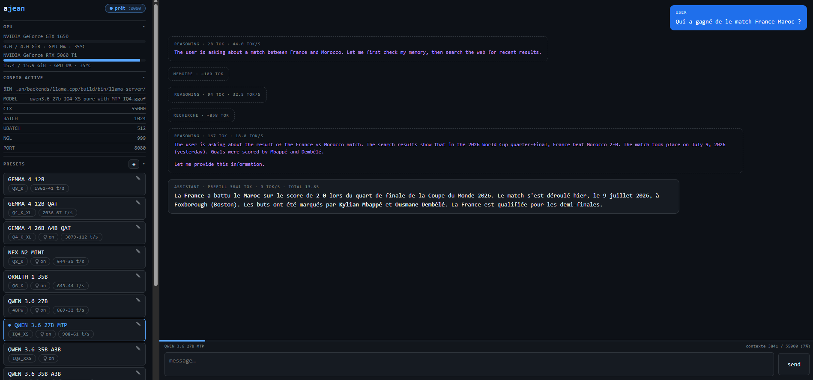

# Jean



**Un gestionnaire mono-binaire pour serveurs [llama.cpp](https://github.com/ggml-org/llama.cpp) auto-hébergés — avec une interface web intégrée, un chat terminal, et un compilateur de backend qui détecte automatiquement le matériel.**

Dépose un seul binaire sur une machine, lance `jean llamacpp install`, et Jean clone, configure et compile llama.cpp pour le matériel de *cette* machine (CUDA / ROCm / Metal / Vulkan / CPU) — aucun flag à retenir. Ensuite `jean start` et tu as un endpoint compatible OpenAI avec un chat web par-dessus.

```
télécharge le binaire  →  jean llamacpp install  →  jean edit  →  jean start  →  c'est parti
```

---

## Pourquoi

Faire tourner llama.cpp comme un vrai service, ça veut dire d'habitude : trouver les bons flags CMake pour ton GPU, écrire une unité systemd, gérer une clé API, changer de modèle, garder le build à jour… Jean transforme tout ça en quelques sous-commandes derrière un binaire statique unique, **sans dépendance à l'exécution** (à part llama.cpp lui-même, que Jean peut compiler pour toi).

## Fonctionnalités

- **`jean llamacpp install` / `update`** — clone et compile llama.cpp avec les bons flags **détectés automatiquement** pour l'hôte :
  - **CUDA** quand un GPU NVIDIA + `nvcc` sont présents (compute capability détectée par GPU via `nvidia-smi`, donc les machines multi-GPU compilent pour toutes les cartes)
  - **ROCm/HIP** (AMD), **Metal** (macOS / Apple Silicon), **Vulkan**, ou repli **CPU**
  - `update` récupère le dernier commit, arrête le service le temps de recompiler, puis le redémarre
- **Intégration systemd** — `jean install` écrit l'unité, une règle sudoers `systemctl` sans mot de passe, et les dossiers de données
- **Interface web** (`jean web`) — chat, changement de modèle/preset, mode agent, accès internet/mémoire, panneau « Accès OpenAI », et réglages d'apparence (thème sombre/clair/doux, mode complet/simple) synchronisés entre appareils
- **Chat terminal** (`jean chat`) — réponses en streaming
- **Accès internet** (`jean internet`) — branche un serveur [Crawl4AI](https://github.com/unclecode/crawl4ai) et l'IA gagne 4 outils web (`web_search` DuckDuckGo, `web_open`, `web_read`, `web_grep`), actifs seulement si le mode agent est actif et le serveur joignable
- **Mémoire persistante à 3 modes** (`jean memory`) — l'IA garde des notes Markdown entre les sessions ; réglable en `off` / `ondemand` (utilisée seulement quand tu le demandes) / `always` (proactive)
- **Accès distant chiffré** (`jean link`) — connecte ce serveur à [ajean.link](https://ajean.link) par une connexion **sortante** (aucun port à ouvrir, marche même en CGNAT). Le chat est **chiffré de bout en bout** : le relais ne voit jamais tes conversations (voir [Sécurité — boîte noire](#sécurité--boîte-noire))
- **Presets** (`jean switch`) — garde plusieurs profils `config.env` et bascule entre eux
- **Protection par clé API** (`jean set-api-key`) — auth Bearer pour exposer le serveur publiquement ; la clé est stockée à part pour survivre aux changements de preset
- **Benchmark** (`jean bench`) — tok/s prefill/decode honnêtes avec un corpus varié
- **Auto-mise à jour** (`jean update`) — récupère la dernière release GitHub et remplace le binaire en place (`--check` pour seulement vérifier)
- **Binaire statique unique** — compilé avec `CGO_ENABLED=0`, se cross-compile trivialement

## Démarrage rapide

### 1. Récupère le binaire

Prends un binaire pré-compilé depuis la page [Releases](../../releases), ou [compile depuis les sources](#compiler-depuis-les-sources) :

```bash
# exemple : Linux x86_64
curl -L -o jean https://github.com/coyotte-hue/jean/releases/latest/download/jean-linux-amd64
chmod +x jean
sudo mv jean /usr/local/bin/jean
```

### 2. Installe (unité systemd, dossiers, sudoers)

```bash
sudo jean install
```

### 3. Compile un backend llama.cpp pour cette machine

```bash
jean llamacpp install
```

Jean détecte ton accélérateur, compile `llama-server`, et pointe la config sur le nouveau binaire. Nécessite `git` et `cmake` (plus le toolkit correspondant, ex. CUDA, si tu veux l'accélération GPU).

### 4. Pointe-le sur un modèle et démarre

```bash
jean edit      # règle MODEL=/chemin/vers/ton-modele.gguf
jean start
jean test      # vérifie que le modèle répond
```

### 5. (optionnel) Interface web

```bash
jean web        # http://<hôte>:8090
```

## Windows

Jean fonctionne aussi sur Windows. Les différences avec Linux :

- **Pas de systemd.** `jean start` lance `jean serve` en arrière-plan (processus détaché), suivi via un fichier PID. `stop` / `restart` / `status` / `logs` agissent dessus — aucun droit administrateur requis. `enable` / `disable` (démarrage au boot) ne sont pas gérés : utilise une tâche planifiée ou `sc.exe` si tu en as besoin.
- **`JEAN_HOME`** vaut par défaut `%ProgramData%\jean` (repli `%LOCALAPPDATA%\jean`). Surcharge avec la variable d'environnement `JEAN_HOME`.
- **`jean install`** crée seulement le dossier de données et un `config.env` de départ (pas de sudoers ni de symlink). Ajoute toi-même le dossier de `jean.exe` au `PATH` pour l'appeler de partout.
- **`jean edit`** ouvre `notepad` par défaut (surchargeable via `%EDITOR%`).
- **`jean tools`** exécute les commandes via `cmd /C` (au lieu de `bash`).

```powershell
# depuis PowerShell
jean install                 # crée %ProgramData%\jean\config.env
jean edit                    # règle BIN=...\llama-server.exe et MODEL=...\modele.gguf
jean start
jean status
jean logs                    # suit %ProgramData%\jean\jean.log
```

`jean llamacpp install` peut compiler llama.cpp si `git` et `cmake` sont présents ; sinon récupère un binaire `llama-server.exe` pré-compilé et pointe `BIN` dessus avec `jean edit`.

## Commandes

```
Service :
  start | stop | restart        gérer le service systemd
  status | logs                 état / logs en direct
  enable | disable              démarrage au boot
  edit                          éditer $JEAN_HOME/config.env
  set-api-key [clé]             protéger llama-server (Bearer) ; vide = générer, "" = retirer
  set-web-key [clé]             protéger l'API de pilotage 'jean web' ; vide = générer, "" = retirer
  vram                          utilisation GPU/VRAM (nvidia-smi)
  gpu [index…]                  liste les GPU / choisit le(s)quel(s) utiliser (gpu all = tous)
  test                          vérifie que le modèle répond (health + completion)
  bench [N]                     mesure prefill + decode tok/s

Presets :
  switch [N]                    choisir un preset dans configs/ (interactif ou par numéro)

Interaction :
  chat [system-prompt]          chat terminal streamé
  web [PORT]                    interface web (défaut :8090)
  internet [on|off|status|url <url>]   accès web de l'IA via un serveur Crawl4AI
  memory [off|ondemand|always|status]  mode mémoire de l'IA (off / sur demande / auto)

Accès distant (ajean.link) :
  link [token]                  démarre le lien au relais en arrière-plan (token = 1re fois / pour le changer)
  link start | restart | stop   démarre / redémarre / arrête le service de lien
  link code                     génère un code d'appairage (valable 10 min, usage unique) pour le portail
  link status | logout          état du lien / oublier le token

Mode agent :
  agent [on|off|status]         active TOUS les outils du modèle (shell complet + mémoire) — un seul interrupteur

Backend (llama.cpp) :
  llamacpp install              clone + compile llama.cpp (détecte CUDA/ROCm/Metal/CPU), règle BIN
  llamacpp update               git pull + recompile le backend existant (arrête/redémarre le service)
  llamacpp status               commit courant, backend détecté, commits de retard sur origin

Installation :
  install                       installer (unité systemd, sudoers, dossiers)
  uninstall                     désinstaller
  update [--check]              mettre à jour jean depuis les releases GitHub (--check = signale sans installer)
  version                       affiche la version installée
```

### Options de `jean llamacpp`

```
install [--dir=CHEMIN] [--ref=REF_GIT] [--force] [--no-switch]
update  [--ref=REF_GIT] [--clean] [--no-restart] [--force]
```

- `--dir=` — où cloner (défaut `$JEAN_HOME/backends/llama.cpp`)
- `--ref=` — compiler une branche/tag/commit précis
- `--clean` — vide `build/` et recompile de zéro
- `--no-switch` — ne touche pas à `config.env` (install seulement)
- `--no-restart` — laisse le service arrêté après la mise à jour

## Configuration

Tout vit sous **`$JEAN_HOME`** (défaut `/etc/jean` sur Linux/macOS, `%ProgramData%\jean` sur Windows). Le service lit `config.env` :

| Clé | Signification | Défaut |
|-----|---------------|--------|
| `BIN` | chemin vers `llama-server` (réglé par `llamacpp install`) | — |
| `MODEL` | chemin vers le modèle `.gguf` | — |
| `HOST` / `PORT` | adresse / port d'écoute | `0.0.0.0` / `8080` |
| `CTX` | taille du contexte | `32768` |
| `NGL` | couches à déporter sur le GPU | `999` |
| `BATCH` / `UBATCH` | batch / micro-batch | `2048` / `512` |
| `THREADS` / `THREADS_BATCH` | threads CPU | `0` (auto) |
| `CUDA_VISIBLE_DEVICES` | GPU à utiliser (réglé par `jean gpu`) | tous |
| `KV_TYPE` (`_K`/`_V`) | quantization du cache KV | — |
| `REASONING` | passthrough du mode raisonnement | — |
| `REASONING_BUDGET` | plafond de tokens de réflexion passé à llama-server ; `-1` = illimité (l'anti-boucle est géré côté agent) | `-1` |
| `TOOL_LIMIT` | plafond d'appels d'outils par tour en mode agent ; `off` = quasi illimité (réglable aussi depuis l'UI) | activé |
| `CRAWL4AI_URL` | URL du serveur Crawl4AI pour l'accès internet (réglé par `jean internet url`) | — |
| `MEM_MODE` | mode mémoire de l'IA : `off` / `ondemand` / `always` (réglé par `jean memory`) | `always` |
| `EXTRA_ARGS` | ajouté tel quel à `llama-server` | — |

La clé API (quand elle est définie avec `jean set-api-key`) est stockée dans `$JEAN_HOME/.api_key`, séparément de `config.env`.

### API de pilotage à distance

`jean web` expose une API HTTP pour piloter Jean à distance : status, VRAM, liste/sélection de presets (switch de modèle), démarrage/arrêt/redémarrage du service, chat. Pour l'exposer sur internet en sécurité, protège-la par une clé :

```
jean set-web-key            # génère une clé aléatoire
jean web 8090               # sert l'API/UI sur :8090
```

Chaque appel `/api/*` doit alors présenter la clé (la page HTML/JS, elle, reste publique car sans secret) :

```
Authorization: Bearer <clé>
```

Endpoints utiles pour un client :

| Méthode | Endpoint | Rôle |
|---------|----------|------|
| GET  | `/api/ping` | vérifie connectivité + validité de la clé (200 / 401) |
| GET  | `/api/status` | état du service (active, health, port) |
| GET  | `/api/vram` | usage GPU/VRAM |
| GET  | `/api/presets` | liste des presets (avec l'actif) |
| POST | `/api/switch` `{"n":<index 1-based>}` | switch de modèle/preset |
| POST | `/api/start` · `/api/stop` · `/api/restart` | piloter le service |
| POST | `/api/chat` `{"messages":[…]}` | chat (flux SSE) |

La clé est stockée dans `$JEAN_HOME/.web_key`, distincte de `.api_key` (pilotage ≠ accès complétions), et relue à chaud à chaque requête. Le pilotage du service est cross-platform (systemd sous Linux, supervision par PID-file sous Windows).

> ⚠️ La clé voyage en clair en HTTP. Pour une exposition publique, place Jean derrière un reverse-proxy HTTPS (Caddy, nginx) ou un tunnel (Tailscale, Cloudflare Tunnel).

### Accès internet de l'IA (Crawl4AI)

Par défaut l'IA n'a pas accès au web. En branchant un serveur [Crawl4AI](https://github.com/unclecode/crawl4ai) (Chrome headless), elle gagne quatre outils : `web_search` (DuckDuckGo), `web_open` (récupère une page → métadonnées + plan), `web_read` (lit une plage de lignes) et `web_grep` (regex dans une page ouverte).

```bash
jean internet url http://localhost:11235   # URL de ton serveur Crawl4AI
jean internet on                           # active l'accès web
jean internet status                       # vérifie que le serveur est joignable
```

Les outils web ne sont proposés au modèle que si **trois conditions** sont réunies : le **mode agent** est actif (`jean agent on`), l'accès internet est activé, **et** le serveur Crawl4AI répond. Sinon ils n'apparaissent pas — le modèle ne peut donc pas les inventer. Réglable aussi depuis l'interface web (section « Accès internet ») et disponible à distance via ajean.link (les outils s'exécutent sur ton serveur, à travers la boîte noire chiffrée).

### Mémoire de l'IA (3 modes)

L'IA peut tenir une mémoire persistante — des pages Markdown sous `$JEAN_HOME/MEMORY/` qu'elle relit et met à jour entre les sessions. Le comportement se règle en trois modes, indépendamment du mode agent :

```bash
jean memory always     # (défaut) l'IA cherche avant de répondre et sauve d'elle-même
jean memory ondemand   # outils dispo, mais utilisés seulement quand tu le demandes
jean memory off        # mémoire coupée : aucun accès en lecture ni écriture
jean memory status
```

### Accès distant via ajean.link

Plutôt que d'exposer un port, `jean link` ouvre une connexion **sortante** vers le relais [ajean.link](https://ajean.link) : ton serveur reste injoignable depuis l'extérieur, mais tu y accèdes quand même depuis n'importe où — idéal derrière une box ou en CGNAT.

```bash
jean link <token>        # token fourni sur ajean.link ; démarre le lien en arrière-plan
jean link code           # un code d'appairage à saisir une fois dans le portail
```

`jean link` tourne comme un **service** (au même titre que `jean` lui-même) : la commande rend la main aussitôt, le lien continue en tâche de fond. Gestion : `jean link restart`, `jean link stop`, `jean link status`. (Pas besoin de `jean web` : l'UI est servie dans le tunnel.)

Une fois lié, tu retrouves depuis le portail :
- l'**interface web** de ton serveur, à distance, avec un **chat chiffré de bout en bout** ;
- la gestion de **plusieurs serveurs** et d'**agents** depuis un tableau de bord ;
- en option, un **endpoint compatible OpenAI** (voir ci-dessous).

C'est un service optionnel et payant ; tout le reste de Jean est et restera open source et gratuit.

### Sécurité — boîte noire

`jean link` est conçu pour que le relais ajean.link soit un **pur tube aveugle** : il transporte tes données mais ne peut pas les lire.

- **Chat chiffré de bout en bout.** Le chat entre ton navigateur et ton serveur Jean est chiffré (X25519 + AES-GCM) : le relais ne voit ni tes prompts ni les réponses, seulement de l'opaque. La clé est dérivée de ton mot de passe (protocole **OPAQUE**) et ne quitte jamais ton navigateur.
- **Empreinte vérifiée.** `jean link` affiche une empreinte de la clé de la machine, à confirmer une fois dans le portail — ça défait toute tentative d'interception par le relais.
- **Appairage authentifié.** En plus de l'empreinte, tu autorises ton navigateur avec un **code d'appairage** (`jean link code`) : à usage unique et valable 10 min, il garantit que seul *ton* navigateur peut piloter le serveur — même un relais compromis ne peut pas forger de commande.
- **Aucun chat en clair par le relais.** L'ancien chemin en clair est refusé à travers le tunnel ; seul le chemin chiffré transporte du contenu.
- **Code servi hors du relais.** Le portail web est livré par une origine indépendante (GitHub Pages), pas par le relais — donc même compromis, le relais ne peut pas injecter de code piégé pour voler ta clé.

> Reste visible du relais : des métadonnées techniques sans contenu (machine en ligne, nom du modèle chargé, VRAM) — jamais tes conversations.

#### Endpoint OpenAI (`<machine>.oai.ajean.link`) — opt-in

Pour brancher des outils tiers (OpenCode, etc.), Jean peut exposer un endpoint compatible OpenAI **par machine** : `https://<machine>.oai.ajean.link/v1`. L'authentification est la clé API de ton `llama-server` (`jean set-api-key`), présentée en `Authorization: Bearer <clé>`. C'est **désactivé par défaut**.

Tu l'actives par machine depuis l'**interface web** (panneau « Accès OpenAI ») : le drapeau est relu **en direct** par le tunnel, sans redémarrage. *(Ancien mécanisme : la variable d'environnement `JEAN_LINK_ALLOW_OAI=1` sur le service — encore acceptée pour rétro-compatibilité, mais le toggle de l'UI est désormais la voie recommandée.)*

Contrairement aux premières versions, ce flux **n'est pas en clair chez le relais** : le VPS fait un simple **passthrough SNI** et le TLS est terminé sur *ta* machine (certificat Let's Encrypt obtenu par l'agent en TLS-ALPN-01, à travers le tunnel). Le relais ne voit donc que des octets chiffrés. L'accès reste soumis au service ajean.link (partie hébergée) : la fonctionnalité doit être ouverte pour ton compte.

### Variables d'environnement

| Variable | Signification | Défaut |
|----------|---------------|--------|
| `JEAN_HOME` | racine des données | `/etc/jean` (ou `$HOME/JEAN`) |
| `JEAN_SERVICE` | nom de l'unité systemd | `jean` |
| `EDITOR` | éditeur pour `jean edit` | `nano` |

## Compiler depuis les sources

Nécessite Go 1.25+. Jean est un binaire 100 % Go (l'UI web est embarquée via `go:embed`) :

```bash
git clone https://github.com/coyotte-hue/jean.git
cd jean
CGO_ENABLED=0 go build -o jean ./cmd/jean

# cross-compilation, ex. Linux depuis n'importe quel hôte :
GOOS=linux GOARCH=amd64 CGO_ENABLED=0 go build -o jean-linux-amd64 ./cmd/jean
```

> Compiler **Jean** ne nécessite que Go. Compiler le **backend llama.cpp** (`jean llamacpp install`) nécessite `git`, `cmake`, et le toolkit de ton accélérateur (CUDA, ROCm, etc.).

## Comment ça marche

- `jean serve` est l'`ExecStart` de systemd : il lit `config.env`, construit la liste d'arguments de `llama-server`, et fait un `exec` dessus pour que systemd supervise directement llama.cpp.
- `jean llamacpp` gère le checkout llama.cpp à côté de l'endroit où pointe `BIN`, en gérant le piège classique du « dossier de build relocalisé » (cache CMake) et en arrêtant le service pendant la recompilation pour éviter le *Text file busy*.

## Arborescence

- `cmd/jean/` — point d'entrée (`main()`) + ressources Windows (.syso, icône, versioninfo).
- `internal/jean/` — tout le code, fichiers préfixés par domaine (`web_*`, `chat_*`, `llm_*`, `backend_*`, `relay_*`, `sys_*` — carte dans `doc.go`).
- `internal/jean/ui/` — UI web embarquée. `index.html` est **généré** : les sources vivent dans `ui/src/` (`styles.css`, `js/NN-*.js` concaténés dans l'ordre alphabétique, `index.tmpl.html`). Pour modifier l'UI : éditer `ui/src/` puis lancer `go generate ./internal/jean` (outil `tools/assemble-ui`, multiplateforme ; le fichier assemblé reste committé car `go:embed` et `ajean-app/build-server-ui.ps1` le lisent tel quel).

## Licence

[MIT](LICENSE). Le fichier `internal/jean/ui/marked.min.js` embarqué est [Marked](https://github.com/markedjs/marked), également MIT.
